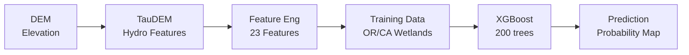

# Lost Meadows Detection

> **Finding lost meadows using machine learning and terrain analysis**

Automated pipeline for detecting historical and unmapped meadow locations using XGBoost classification on hydrogeomorphic and soil features. Based on *"Resetting the baseline: using machine learning to find lost meadows"* (Cummings et al., 2023).

[](https://www.python.org/)
[](https://github.com)
[](LICENSE)

---

## What It Does

Takes a **10m elevation raster** → Generates **23 terrain and soil features** → Trains an **XGBoost model** → Outputs a **meadow probability map**

**Input**: Digital Elevation Model (DEM) for a specific watershed (from Google Earth Engine)
**Output**: Probability raster showing where meadows likely exist or have been lost (0.0 – 1.0)

---

## Quick Start

### Installation
```bash
# 1. Clone repository
git clone https://github.com/RaiderSoft/Lost-Meadows.git
cd Lost-Meadows

# 2. Install mamba and create environment
conda install -c conda-forge mamba -y
conda create -n meadow -c conda-forge taudem python=3.11 -y
conda activate meadow

# 3. Install Python dependencies
mamba install -c conda-forge rasterio numpy scipy pandas scikit-learn geopandas xgboost mlflow -y
pip install dagshub
```

**Full installation guide**: See [SETUP.md](SETUP.md) for detailed instructions including data downloads.

### Get Required Data

All required data files are provided as GitHub Releases. Go to the [Releases page](https://github.com/RaiderSoft/Lost-Meadows/releases) and download:

| Release | Contents | Destination |
|---------|----------|-------------|
| **TIFInputFiles** | 3 soil TIF files | Extract into `GEE/TIF_Input/Soil/` |
| **WetlandGeodatabases** | OR + CA wetland geodatabases (zipped) | Unzip each `.gdb` folder into `Wetlands/` |
| **GEEInputFiles** | 122 watershed rasters split across two zip files | Unzip both archives, find the desired watershed `.tif`, and place it into `GEE/TIF_Input/` |

See [SETUP.md](SETUP.md) for step-by-step instructions.

### Run Pipeline
```bash
conda activate meadow

# Process a watershed (takes 2-4 hours)
python run_pipeline.py GEE/TIF_Input/Hunter_Creek_1710031205.tif
```

**Output**: `GEE/TIF_Output/Hunter_Creek_1710031205/Hunter_Creek_1710031205_meadow_probability.tif`

---

## How It Works



### Pipeline Steps

| Step | Process | Outputs |
|------|---------|---------|
| **1. TauDEM** | Hydrological analysis | Flow direction, stream network, distances to stream |
| **2a. TWI 10m** | Topographic Wetness Index at native resolution | `twi_10m.tif` |
| **2b. TWI 100m** | TWI at landscape scale, resampled to 10m | `twi_100m.tif` |
| **3. Terrain** | Slope and elevation variability | Slope, relative elevation, std deviations |
| **4. Advanced** | Aspect, curvature, TPI, TRI | 11 additional terrain features |
| **4b. Soil** | Soil property rasters cropped to watershed | Depth to restrictive layer, hydraulic connectivity, organic matter |
| **5. Stacking** | Combine all features | 23-band multi-layer raster |
| **6. Training Data** | Sample wetland labels from OR/CA geodatabases | 100,000 labeled pixels (1:4 meadow:non-meadow ratio) |
| **7. Model** | XGBoost classifier | Trained model `.pkl` |
| **8. Prediction** | Apply model to watershed | Meadow probability map (0–1) |

### Features Generated (23 Total)

| Group | Features | Count |
|-------|----------|-------|
| **TWI** | TWI 10m, TWI 100m | 2 |
| **Terrain** | Slope, relative elevation, elevation std dev, slope std dev | 4 |
| **Stream Distance** | Surface distance (dd_s), horizontal distance (dd_h), vertical distance (dd_v) | 3 |
| **Advanced Terrain** | Aspect, profile curvature, plan curvature, absolute elevation, TPI 3×3, TPI 11×11, TPI 21×21, TRI, elevation std 3×3, elevation std 9×9, slope std 9×9 | 11 |
| **Soil** | Depth to restrictive layer, hydraulic connectivity, organic matter % | 3 |

> Precipitation features were evaluated and excluded — they did not improve model performance on this dataset.

---

## Project Structure

```
Lost-Meadows/
├── run_pipeline.py              # Master script — runs the entire workflow
├── environment.yml              # Conda environment specification
├── SETUP.md                     # Installation and data setup guide
│
├── GEE/                         # Google Earth Engine scripts and data
│   ├── LostMeadowsApplication.js   # Interactive GEE map viewer
│   ├── TIF_Export.js               # Export DEMs from GEE
│   ├── ExportPrecipitation.js      # Export precipitation from GEE (archived)
│   ├── MeadowVisualization.js      # Visualization helpers
│   ├── TIF_Input/                  # Place watershed DEM files here
│   │   └── Soil/                   # Soil TIF files (from TIFInputFiles release)
│   └── TIF_Output/                 # Pipeline outputs organized by watershed
│       ├── Hunter_Creek_1710031205/
│       ├── Bear_Creek_1710030801/
│       └── East_Fork_Illinois_River_1710031103/
│
├── TauDEM/                      # Hydrological processing
│   └── run_taudem_workflow.py
│
├── FeatureEngineering/          # Feature calculation scripts
│   ├── TWI/                     # Topographic Wetness Index (10m and 100m)
│   ├── Terrain/                 # Slope, elevation, variability
│   ├── Advanced/                # Aspect, curvature, TPI, TRI, multi-scale terrain
│   └── Soil/                    # Soil feature processing
│
├── FeatureStacking/             # Combines all features into a single multi-band raster
│   └── stack_features.py
│
├── Wetlands/                    # Training data preparation
│   ├── prepare_training_data.py
│   ├── OR_geodatabase_wetlands.gdb/  # Download from WetlandGeodatabases release
│   └── CA_geodatabase_wetlands.gdb/  # Download from WetlandGeodatabases release
│
└── ModelTraining/               # ML model scripts
    ├── train_xgboost.py         # Primary model (used in pipeline)
    ├── predict_meadows.py       # Inference — applies model to feature stack
    ├── mlflow_config.py         # DagsHub experiment tracking config
    ├── train_random_forest.py   # Comparison model (not in pipeline — see note in file)
    └── xgboost_gridsearch.py    # Hyperparameter tuning utility (not in pipeline — see note in file)
```

---

## Usage Examples

### Process Multiple Watersheds

```bash
conda activate meadow

# Watershed 1
python run_pipeline.py GEE/TIF_Input/Hunter_Creek_1710031205.tif

# Watershed 2
python run_pipeline.py GEE/TIF_Input/Bear_Creek_1710030801.tif
```

Each watershed gets its own output folder under `GEE/TIF_Output/`.

### Run Individual Steps

```bash
conda activate meadow

# Step 1: TauDEM
cd TauDEM
python run_taudem_workflow.py ../GEE/TIF_Input/Hunter_Creek_1710031205.tif

# Step 2: TWI
cd ../FeatureEngineering/TWI
python calculate_twi_10m.py Hunter_Creek_1710031205
python calculate_twi_100m.py Hunter_Creek_1710031205

# Step 3: Terrain features
cd ../Terrain
python calculate_terrain_features.py Hunter_Creek_1710031205

# Step 4: Advanced + Soil
cd ../Advanced
python calculate_advanced_features.py Hunter_Creek_1710031205
cd ../Soil
python calculate_soil_features.py Hunter_Creek_1710031205

# Step 5: Stack
cd ../../FeatureStacking
python stack_features.py Hunter_Creek_1710031205

# Step 6: Training data
cd ../Wetlands
python prepare_training_data.py Hunter_Creek_1710031205

# Step 7-8: Train and predict
cd ../ModelTraining
python train_xgboost.py Hunter_Creek_1710031205
python predict_meadows.py Hunter_Creek_1710031205
```

### Visualize in Google Earth Engine

1. Upload `{watershed}_meadow_probability.tif` to GEE Assets
2. Update the asset ID in `GEE/LostMeadowsApplication.js`
3. Run the script in the [GEE Code Editor](https://code.earthengine.google.com)

---

## Model Performance

Based on Cummings et al. (2023) with an expanded 23-feature set:

- **Algorithm**: XGBoost (200 trees)
- **Features**: 23 hydrogeomorphic and soil variables (expanded from original 9)
- **Training ratio**: 1:4 (meadow : non-meadow pixels)
- **Validation**: 75/25 train/test split
- **Expected AUC**: >0.89 for local watershed models

---

## Requirements

**Software:**
- Python 3.11
- TauDEM 5.3+ (hydrological analysis, installed via conda)
- GDAL 3.6+ (installed with rasterio)
- MPI (parallel processing, installed with TauDEM)

**Hardware:**
- **CPU**: 4+ cores (8 recommended)
- **RAM**: 8 GB minimum (16 GB recommended)
- **Disk**: ~10 GB for dependencies + 2–5 GB per watershed

**Data (all available from [GitHub Releases](https://github.com/RaiderSoft/Lost-Meadows/releases)):**
- Watershed DEM rasters (GEEInputFiles release)
- Oregon and California wetland geodatabases (WetlandGeodatabases release)
- Soil TIF files (TIFInputFiles release)

---

## Why This Matters

Meadows provide critical ecosystem services but many have been lost or degraded:

- **Water storage** — Natural sponges that regulate streamflow
- **Biodiversity** — Habitat for diverse plant and animal species
- **Carbon sequestration** — Store carbon in soils
- **Erosion control** — Stabilize soil and prevent degradation

This tool identifies:
- Unmapped current meadows
- Historical meadow locations that are now degraded
- High-priority restoration sites

Traditional field surveys are slow and expensive. Machine learning enables landscape-scale assessment across hundreds of watersheds.

---

## Documentation

- **[SETUP.md](SETUP.md)** — Full installation and data setup guide
- **[docs/](docs/)** — Project website ([live site](https://raidersoft.github.io/Lost-Meadows/))
- **Original Paper** — Cummings et al. (2023), *"Resetting the baseline: using machine learning to find lost meadows"*

---

## Acknowledgments

- **Research**: Cummings et al. (2023)
- **Tools**: TauDEM development team, Google Earth Engine
- **Data**: Oregon/California National Wetlands Inventory
- **Platform**: Google Earth Engine, DagsHub (experiment tracking)

---

<div align="center">

[Website](https://raidersoft.github.io/Lost-Meadows/)

</div>
