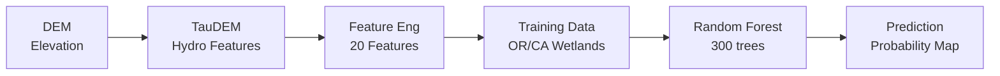

# Lost Meadows Detection

> **Finding lost meadows using machine learning and terrain analysis**

Automated pipeline for detecting historical and unmapped meadow locations using Random Forest classification on hydrogeomorphic features. Based on *"Resetting the baseline: using machine learning to find lost meadows"* (Cummings et al., 2023).

[](https://www.python.org/)
[](https://github.com)
[](LICENSE)

---

## What It Does

Takes a **10m elevation raster** → Generates **20 terrain features** → Trains **Random Forest model** → Outputs **meadow probability map**

**Input**: Digital Elevation Model (DEM) from Google Earth Engine
**Output**: Probability map showing where meadows likely exist (0.0 - 1.0 scale)

---

## Quick Start

### Installation
```bash
# 1. Clone repository
git clone https://github.com/your-username/Lost-Meadows.git
cd Lost-Meadows

# 2. Set up environment
conda env create -f environment.yml
conda activate meadow

# 3. Install TauDEM (Ubuntu/WSL2)
sudo apt install taudem
```

 **Full installation guide**: See [SETUP.md](SETUP.md) for detailed instructions (including Windows/macOS)

### Run Pipeline
```bash
# Process a watershed (takes 2-4 hours)
python run_pipeline.py GEE/TIF_Input/Hunter_Creek_1710031205.tif
```

**Output**: `TIF_Output/Hunter_Creek_1710031205_meadow_probability.tif`

---

## How It Works



### Pipeline Steps

| Step | Process | Outputs |
|------|---------|---------|
| **1. TauDEM** | Hydrological analysis | Flow direction, stream network, distances |
| **2. TWI** | Topographic Wetness Index | TWI at 10m and 100m scales |
| **3. Terrain** | Slope & variability | Slope, relative elevation, std deviations |
| **4. Stacking** | Combine features | 20-band multi-layer raster |
| **5. Training** | Sample wetlands | 10,000 labeled pixels (1:9 ratio) |
| **6. Model** | Random Forest ML | Trained classifier (.pkl) |
| **7. Prediction** | Apply to watershed | Meadow probability map (0-1) |

### Features Generated

| Feature | Description | Why It Matters |
|---------|-------------|----------------|
| **TWI 10m** | Topographic Wetness Index | Water accumulation patterns |
| **TWI 100m** | TWI at landscape scale | Broader drainage context |
| **Slope** | Terrain steepness | Meadows prefer gentle slopes |
| **Distance (S/H/V)** | Surface/Horizontal/Vertical to stream | Proximity to water sources |
| **Elev Relative** | Position in landscape | Valley bottom indicator |
| **Elev Std Dev** | Terrain roughness | Meadows are flatter |
| **Slope Std Dev** | Topographic complexity | Uniformity indicator |

---

## Project Structure

```
Lost-Meadows/
├── run_pipeline.py              # Master script - runs entire workflow
├── environment.yml              # Conda environment (Python + dependencies)
├── SETUP.md                     # Installation guide
│
├── GEE/                         # Google Earth Engine scripts
│   ├── TIF_Export.js            # Export DEMs from GEE
│   ├── MeadowVisualization.js   # Interactive map viewer
│   ├── TIF_Input/               # Place input DEMs here
│   └── TIF_Output/              # Results organized by watershed name
│       ├── Hunter_Creek_1710031205/
│       ├── Bear_Creek_1710030801/
│       └── ...
│
├── TauDEM/                      # Hydrological processing
├── FeatureEngineering/          # Terrain feature calculation
├── FeatureStacking/             # Combine into multi-band raster
├── Wetlands/                    # Training data preparation
│   ├── OR_geodatabase_wetlands.gdb/  # Download separately
│   └── CA_geodatabase_wetlands.gdb/  # Download separately
└── ModelTraining/               # Random Forest ML
```

---

## Usage Examples

### Process Multiple Watersheds

```bash
# Watershed 1
python run_pipeline.py GEE/TIF_Input/Hunter_Creek_1710031205.tif
# → Output: TIF_Output/Hunter_Creek_1710031205/

# Watershed 2
python run_pipeline.py GEE/TIF_Input/Bear_Creek_1710030801.tif
# → Output: TIF_Output/Bear_Creek_1710030801/

# Each watershed gets its own descriptive folder!
```

### Run Individual Steps

```bash
conda activate meadow

# Step 1: TauDEM
cd TauDEM
python run_taudem_workflow.py ../GEE/TIF_Input/Hunter_Creek_1710031205.tif

# Step 2-3: Features
cd ../FeatureEngineering/TWI
python calculate_twi_10m.py Hunter_Creek_1710031205
python calculate_twi_100m.py Hunter_Creek_1710031205

cd ../Terrain
python calculate_terrain_features.py Hunter_Creek_1710031205

# Step 4-7: Stack, train, predict
cd ../../FeatureStacking
python stack_features.py Hunter_Creek_1710031205

cd ../Wetlands
python prepare_training_data.py Hunter_Creek_1710031205

cd ../ModelTraining
python train_random_forest.py Hunter_Creek_1710031205
python predict_meadows.py Hunter_Creek_1710031205
```

### Visualize in Google Earth Engine

1. Upload `{watershed}_meadow_probability.tif` to GEE Assets
2. Update asset ID in `GEE/MeadowVisualization.js` (line 12)
3. Run script in [GEE Code Editor](https://code.earthengine.google.com)
4. Explore interactive map with multiple color palettes!

---

## Model Performance

Based on Cummings et al. (2023) with expanded feature set:
- **Algorithm**: Random Forest (300 trees)
- **Features**: 20 hydrogeomorphic variables (expanded from original 9)
- **Training**: 1:9 class imbalance (meadow:non-meadow)
- **Validation**: 75/25 train/test split
- **Expected AUC**: >0.89 for local models

---

## Requirements

**Software:**
- Python 3.10+
- TauDEM 5.3+ (hydrological analysis)
- GDAL 3.6+ (geospatial library)
- MPI (parallel processing)

**Hardware:**
- **CPU**: 4+ cores (8 recommended)
- **RAM**: 8 GB minimum (16 GB recommended)
- **Disk**: ~10 GB for dependencies + 2-5 GB per watershed

**Data:**
- Oregon/California wetland geodatabases (~2.4 GB total)
- See [SETUP.md](SETUP.md) for download links

---

## Why This Matters

Meadows provide critical ecosystem services but many have been lost or degraded:
-  **Water storage** - Natural sponges that regulate streamflow
-  **Biodiversity** - Habitat for diverse plant and animal species
-  **Carbon sequestration** - Store carbon in soils
-  **Erosion control** - Stabilize soil and prevent degradation

This tool helps identify:
- Unmapped current meadows
- Historical meadow locations (now degraded)
- High-priority restoration sites

**Scale matters**: Traditional field surveys are slow and expensive. Machine learning enables landscape-scale assessment.


---

## Documentation

- **[SETUP.md](SETUP.md)** - Installation guide (Linux/macOS/Windows)
- **[docs/](docs/)** - Project website (GitHub Pages)
- **Original Paper** - Cummings et al. (2023)


---

## Acknowledgments

- **Research**: Cummings et al. (2023)
- **Tools**: TauDEM development team, Google Earth Engine
- **Data**: Oregon/California National Wetlands Inventory
- **Platform**: Google Earth Engine

---

<div align="center">


[Website](https://raidersoft.github.io/Lost-Meadows/)

</div>
